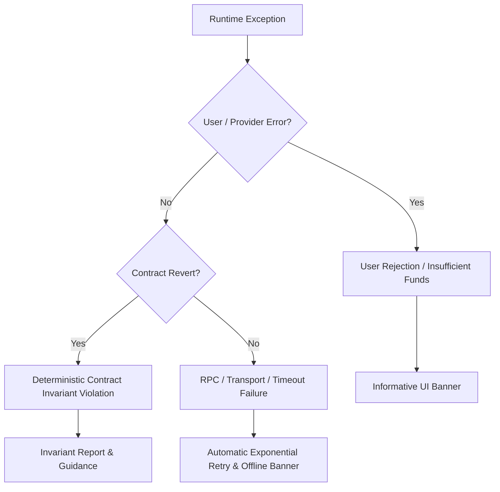
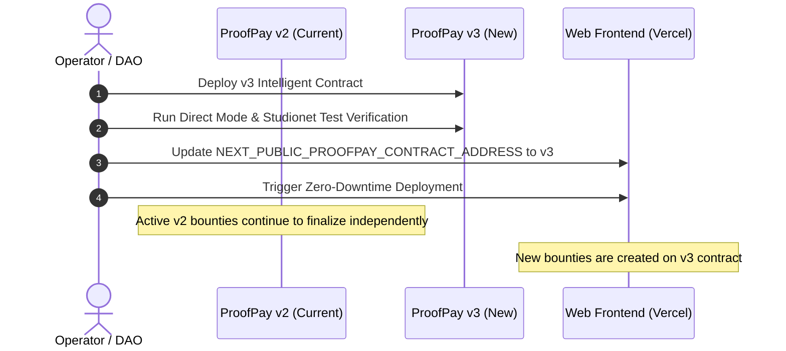

# ProofPay Operations & Incident Response Manual

This document defines production operational standards, RPC health monitoring, structured error handling, incident response runbooks, contract migration procedures, and regulatory disclosures for ProofPay.

---

## 1. RPC Health Monitoring Architecture

### 1.1 Overview & Endpoint Topology
ProofPay interacts with the GenLayer consensus network via JSON-RPC. Reliable dApp operation requires continuous health verification of the RPC endpoints and GenVM execution layer.

| Network | Primary RPC Endpoint | Chain ID | Explorer |
| --- | --- | --- | --- |
| **GenLayer Studionet** | `https://studio.genlayer.com/api` | `61999` (`0xf22f`) | `https://explorer-studio.genlayer.com` |
| **Localnet (Dev)** | `http://127.0.0.1:4000/api` | `61998` | Local GenVM Inspector |

### 1.2 Automated Health & Liveness Probe
A Node.js operational health probe is provided at [`scripts/check-rpc-health.mjs`](file:///c:/Users/9ytshade/Desktop/Genlayer%20Intelligent%20Contracts/proofpay/scripts/check-rpc-health.mjs). It performs automated round-trip latency measurements, verifies block progression, and validates network ID alignment.

```bash
# Run probe against default Studionet endpoint
node scripts/check-rpc-health.mjs

# Run with custom RPC target and latency threshold
GENLAYER_RPC_URL="https://studio.genlayer.com/api" MAX_RPC_LATENCY_MS="5000" node scripts/check-rpc-health.mjs
```

### 1.3 Key Metrics & Alert Thresholds
Production monitoring agents (Datadog, Grafana, or Uptime Kuma) should poll the RPC probe every 60 seconds against these thresholds:

| Metric | Target Normal | Warning Threshold (P2) | Critical Alert (P1) | Remediation Action |
| --- | --- | --- | --- | --- |
| **JSON-RPC Latency** | `< 2,500 ms` | `> 5,000 ms` | `> 15,000 ms` (or timeout) | Failover to backup RPC node |
| **Block Number Drift** | Advances every ~3s | No advance for 60s | No advance for 180s | Alert GenLayer core team; consensus stalled |
| **HTTP Status Code** | `200 OK` | `429 Rate Limited` | `502 / 503 / 504 Gateway Error` | Activate Cloudflare rate-limit bypass / retry queue |
| **Chain ID Check** | Returns `61999` | Mismatched ID | Non-responsive | Isolate endpoint; prevent wallet user misdirection |

---

## 2. Client-Side Error Logging & Observability

### 2.1 Error Categorization Matrix
All frontend runtime errors in `web/` are categorized into distinct operational classes:



1. **User / Provider Exceptions:**
   - Error Codes: `ACTION_REJECTED` (User rejected signature), `UNSUPPORTED_CHAIN` (MetaMask on wrong network).
   - Handling: Non-fatal banner, actionable switch prompt.
2. **Contract Invariant Violations:**
   - Examples: `Deadline must be in future`, `Self-submission disallowed`, `Criteria count out of bounds [1..10]`.
   - Handling: Surfaces the exact contract error reason directly from simulation data without wasting gas.
3. **Transport / Network Failures:**
   - Examples: Cloudflare rate limit, dropped WebSocket, network timeout.
   - Handling: Caught by `isTransportFailure()` in `genlayer.ts`, triggering automatic retry and user notification.

### 2.2 Privacy-Preserving Observability Guidelines
When integrating third-party crash reporting (e.g., Sentry, Bugsnag):
- **Preserved:** Public wallet address, target contract address, bounty ID, transaction hash, error stack trace.
- **Redacted / Scrubbed:** Full raw GitHub source payloads, local storage keys, session tokens, builder private notes.

---

## 3. Incident Response Runbook

### 3.1 Severity Classifications
- **SEV-1 (Critical):** Consensus failure, zero-day in GenVM execution, contract funds locked or at risk.
- **SEV-2 (High):** Studionet RPC endpoint unreachable for > 15 minutes, public web frontend offline.
- **SEV-3 (Medium):** Validator LLM timeout causing repeated `UNDETERMINED` verdicts on valid evidence.
- **SEV-4 (Low):** Minor UI visual defect, Markdown rendering formatting anomaly.

---

### 3.2 Specific Incident Response Procedures

#### Incident A: RPC Node Outage / Cloudflare 502/503 Gateways
1. **Diagnosis:** Run `node scripts/check-rpc-health.mjs`. If connection times out or HTTP 502 occurs, confirm whether issue is local or network-wide.
2. **Triage:** Check official GenLayer discord / status page.
3. **Mitigation:**
   - If secondary RPC endpoint is available, update `NEXT_PUBLIC_GENLAYER_RPC_URL` in Vercel environment variables.
   - Trigger instant zero-downtime redeploy via Vercel CLI: `vercel --prod`.
   - Post operational status banner on dApp home page.

#### Incident B: Stuck Adjudication / "UNDETERMINED" Consensus
1. **Root Cause Analysis:** An `UNDETERMINED` adjudication occurs when validator HTTP fetch to GitHub raw or deployment returns transient 429, 502, 503, or 504.
2. **Protocol Invariant:** The bounty remains in `submitted` status; funds are NOT refunded and NOT paid out.
3. **Resolution:**
   - Wait 5 minutes for upstream server recovery.
   - Any actor (or builder) re-invokes `adjudicate_submission(bounty_id, submission_id)`.
   - Validators re-fetch external evidence and reach consensus.

#### Incident C: Competing Builders Race Conditions
1. **Observed Behavior:** Multiple builders submit proofs for the same high-reward open bounty in parallel.
2. **Security Guarantee:**
   - The contract evaluates submissions sequentially.
   - The first submission reaching `APPROVED` consensus receives the full escrow payout immediately.
   - The bounty transitions to `awarded`.
   - All subsequent submissions for that bounty are immediately rejected by the contract (`Bounty is not open for submission`).
   - Escrow balance invariant is maintained: exactly 1 payout per bounty, zero double-spend possibility.

#### Incident D: Compromised Client Account Private Key
1. **Immediate Action:** The user must identify all open bounties created by that address where `submissions == 0`.
2. **Remediation:** Call `cancel_bounty(bounty_id)` immediately from the client key before an attacker or unintended party interacts.
3. **Result:** Escrow is refunded directly to the caller.

---

## 4. Smart Contract Migration & Rollback Strategy

### 4.1 Non-Upgradeability Architecture
ProofPay intelligent contracts are deliberately deployed as **immutable, non-upgradeable autonomous programs**:
- **No Admin Keys:** No centralized owner can pause, confiscate funds, or alter contract bytecode.
- **No Upgrade Proxies:** Eliminates proxy storage collision risks and centralization backdoors.
- **Consensus Bound:** Rules encoded in `contracts/proofpay.py` are permanent for that deployment address.

### 4.2 Safe Migration Procedure (e.g. v2 to v3)
When introducing architectural improvements or new GenLayer SDK capabilities:



1. **Phase 1 (Parallel Run):**
   - Deploy new contract `vNext` on GenLayer network.
   - Existing open bounties on `vCurrent` remain active until deadlines expire or awards complete.
   - Inactive/expired bounties on `vCurrent` can be refunded via `refund_expired_bounty` or cancelled via `cancel_bounty`.
2. **Phase 2 (Frontend Switch):**
   - Update `NEXT_PUBLIC_PROOFPAY_CONTRACT_ADDRESS` to `0x<NewContractAddress>`.
   - Deploy updated frontend.
   - The frontend automatically queries the new contract for all new bounty creation and review operations.
3. **Phase 3 (Legacy Archival):**
   - Archive legacy contract address in repository documentation (`STUDIONET_V2_RUN_2026-10-01.md`).

---

## 5. Regulatory & Financial Disclosures

### 5.1 Testnet / Studionet Token Notice
- **No Economic Value:** All transactions executed on GenLayer Studionet (`chain_id=61999`) or GenLayer Testnet utilize test tokens (GEN). These tokens are issued solely for experimental software testing and developer validation. They have **no fiat value, no investment utility, and cannot be redeemed for legal tender**.
- **Faucet Availability:** Testnet tokens are distributed free of charge via authorized community faucets.

### 5.2 Non-Custodial Software Disclaimer
- ProofPay is an open-source decentralized software interface connecting users to the GenLayer blockchain.
- The authors and maintainers do **not** act as custodians, escrow agents, trustees, or financial intermediaries.
- All escrow funds are locked directly in the autonomous GenVM smart contract and are governed exclusively by consensus math and validator execution.
